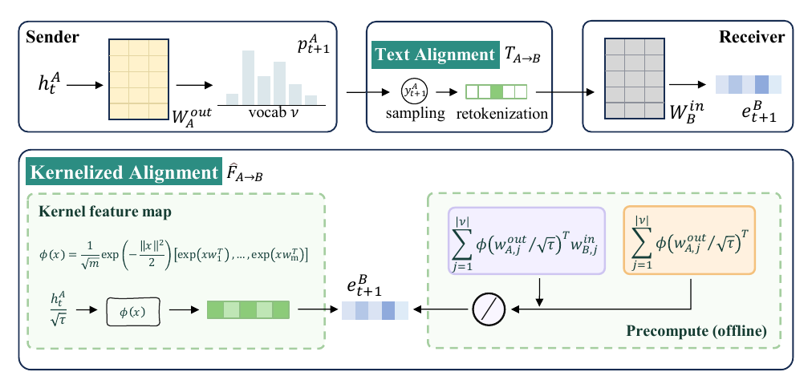
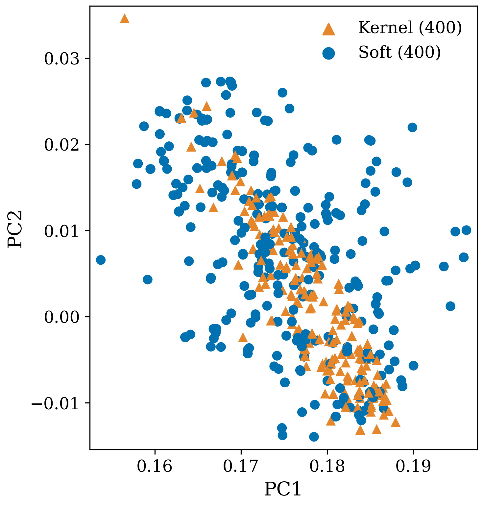
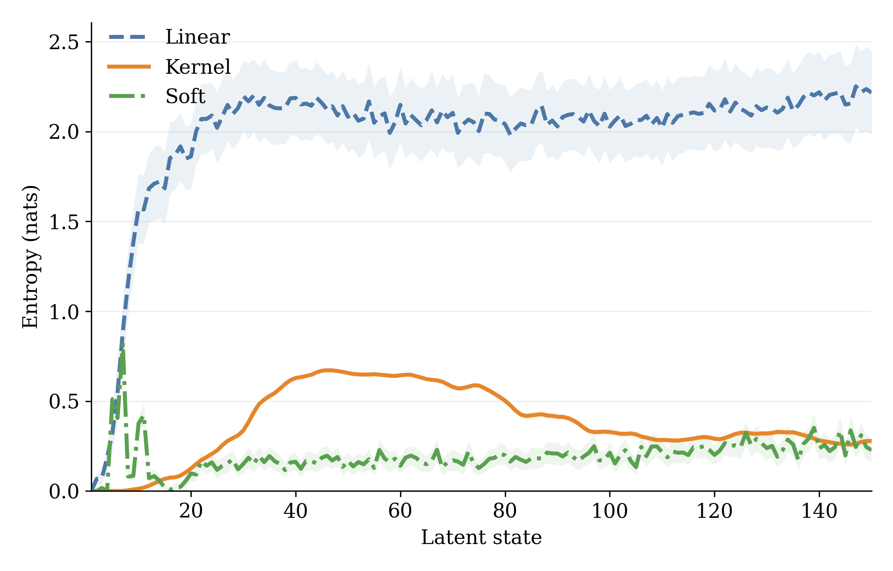
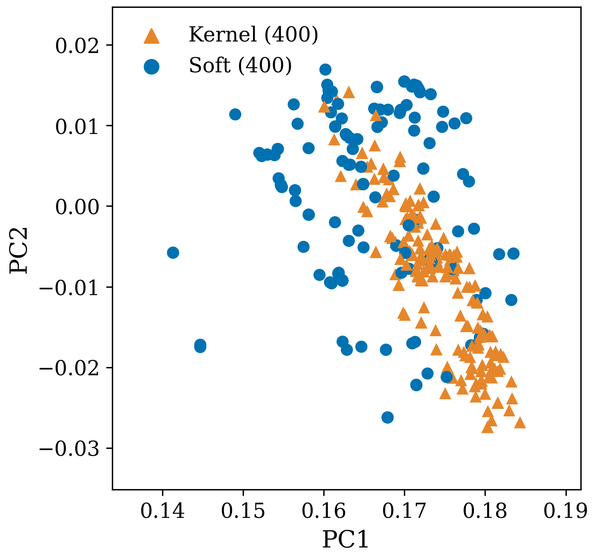
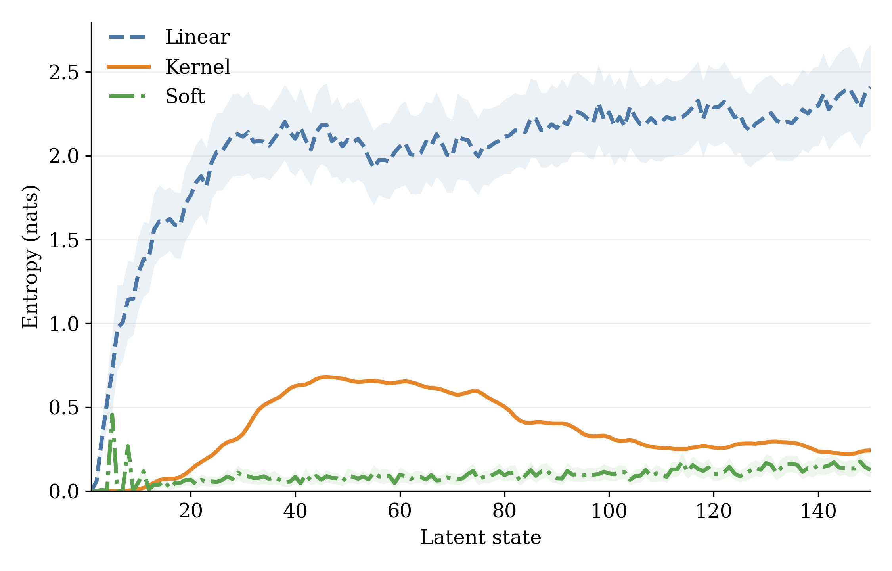
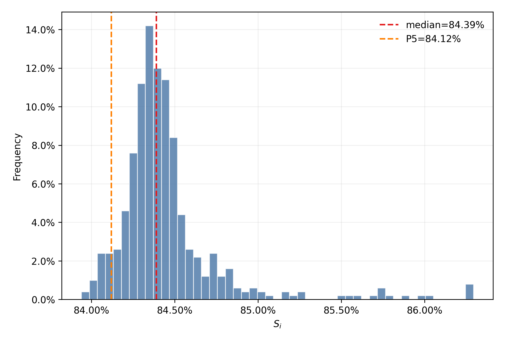

<p align="center">
  <a href="assets/model.pdf">
    
  </a>
</p>

<h1 align="center">Kernelized Latent Alignment for Multi-Agent Systems</h1>

<p align="center">
  <strong>A Training-free Latent Alignment for Latent Reasoning and Cross-Model Communication.</strong>
</p>

<p align="center">
  <a href="#overview">Overview</a> &middot;
  <a href="#method">Method</a> &middot;
  <a href="#results">Results</a> &middot;
  <a href="#analysis">Analysis</a> &middot;
  <a href="#installation">Installation</a> &middot;
  <a href="#quick-start">Quick start</a> &middot;
  <a href="#reproduction">Reproduction</a>
</p>

---

## Overview

Kernel Align transfers a sender model's final-layer hidden states into a receiver model's input-embedding space without decoding intermediate text and without training an adapter. This repository supports continuous reasoning within a Qwen3 checkpoint and latent communication between tokenizer-compatible Qwen3 checkpoints.

The central observation is that exact soft alignment can be written as vocabulary attention: the sender hidden state is the query, sender unembedding rows are keys, and receiver input embeddings are values. Kernel Align uses positive orthogonal random features (ORFs) to replace the full-vocabulary softmax with a compact feature map whose vocabulary-dependent statistics can be precomputed.

| Property | Kernel Align |
|:--|:--|
| Training | None |
| Intermediate medium | Continuous hidden states |
| Online alignment cost | $O(m(d_A+d_B))$, with $m \ll |\mathcal V|$ |
| Homogeneous agents | Supported |
| Heterogeneous agents | Supported between tokenizer-compatible Qwen3 checkpoints |
| Architectures | Sequential and hierarchical |
| Supported models | Qwen3-8B and Qwen3-14B |

### Reference results

Across six reference benchmarks, Kernel Align improves both accuracy and end-to-end efficiency relative to exact soft alignment.

| Model | Inference speedup | Average accuracy gain |
|:--|--:|--:|
| Qwen3-8B | 2.93&times; | +2.97 percentage points |
| Qwen3-14B | 2.52&times; | +2.28 percentage points |

The six primary benchmarks are AIME 2024, AIME 2025, HumanEval+, MBPP+, GPQA-Diamond, and MedQA. The complete evaluation covers nine benchmarks across three domains by additionally including GSM8K, ARC-Easy, and ARC-Challenge.

<a id="method"></a>
<details>
<summary><strong>Method</strong></summary>

<br>

For sender $A$, receiver $B$, sender hidden state $h^A$, sender output rows $w^{out}_{A,j}$, and receiver input rows $w^{in}_{B,j}$, exact soft alignment is

$$
F_{A\rightarrow B}(h^A)=
\frac{\sum_j \exp\!\left(h^A(w^{out}_{A,j})^\top/\tau\right)w^{in}_{B,j}}
     {\sum_j \exp\!\left(h^A(w^{out}_{A,j})^\top/\tau\right)}.
$$

Kernel Align approximates the exponential kernel with a positive ORF map $\phi$:

$$
\widehat F_{A\rightarrow B}(h^A)=
\frac{\phi(h^A/\sqrt\tau)S_{A\rightarrow B}}
     {\phi(h^A/\sqrt\tau)z_A}.
$$

$S_{A\rightarrow B}$ and $z_A$ depend only on fixed embedding matrices and are aggregated before latent rollout. This changes the per-step alignment cost from $O(|\mathcal V|(d_A+d_B))$ to $O(m(d_A+d_B))$.

Kernel Align provides one interface for two operations:

- **Intra-agent reasoning:** map a hidden state back into the same model's embedding space for another continuous reasoning step.
- **Inter-agent communication:** map sender states into a different receiver's embedding space.

The heterogeneous implementation verifies identical token-to-ID mappings before constructing a sender&ndash;receiver operator. Sender and receiver hidden dimensions may differ.

</details>

<a id="results"></a>
<details>
<summary><strong>Results</strong></summary>

<br>

All results below use the sequential configuration and report the mean over three runs. Accuracy is reported as a percentage (pass@1 for code generation); values after &plusmn; are standard deviations. Token is the mean number of vocabulary-level decoding operations per problem, and Time is the mean inference time in seconds per problem. Text and Linear values in the homogeneous comparison are published LatentMAS baselines, with their times converted to the throughput of the evaluation machine.

### Homogeneous collaboration

Each agent uses the same Qwen3 checkpoint. Kernel Align reaches the highest average accuracy at both model scales while reducing average end-to-end time relative to Exact-Soft Align by 2.93&times; on Qwen3-8B and 2.52&times; on Qwen3-14B.

#### Qwen3-8B accuracy

| Benchmark | Text | Linear Align | Exact-Soft Align | Kernel Align |
|:--|--:|--:|--:|--:|
| AIME 2024 | 53.30 | 56.70 | 62.22 &plusmn; 6.85 | 68.89 &plusmn; 1.57 |
| AIME 2025 | 53.30 | 53.30 | 52.22 &plusmn; 8.31 | 54.44 &plusmn; 4.16 |
| HumanEval+ | 80.50 | 80.50 | 83.13 &plusmn; 2.24 | 83.94 &plusmn; 0.57 |
| MBPP+ | 69.50 | 74.60 | 72.49 &plusmn; 0.75 | 75.40 &plusmn; 0.22 |
| GPQA-Diamond | 43.40 | 45.50 | 48.48 &plusmn; 1.24 | 49.16 &plusmn; 1.04 |
| MedQA | 75.00 | 75.30 | 68.67 &plusmn; 1.44 | 73.22 &plusmn; 0.87 |
| **Average** | **62.50** | **64.32** | **64.54** | **67.51** |

#### Qwen3-14B accuracy

| Benchmark | Text | Linear Align | Exact-Soft Align | Kernel Align |
|:--|--:|--:|--:|--:|
| AIME 2024 | 63.30 | 66.70 | 68.89 &plusmn; 5.67 | 75.56 &plusmn; 3.14 |
| AIME 2025 | 60.00 | 63.30 | 54.44 &plusmn; 3.14 | 60.00 &plusmn; 2.72 |
| HumanEval+ | 81.10 | 86.50 | 91.26 &plusmn; 1.44 | 88.21 &plusmn; 0.57 |
| MBPP+ | 72.80 | 75.70 | 79.98 &plusmn; 0.15 | 78.13 &plusmn; 0.12 |
| GPQA-Diamond | 51.50 | 52.00 | 52.53 &plusmn; 1.24 | 56.23 &plusmn; 0.48 |
| MedQA | 80.30 | 80.70 | 78.11 &plusmn; 0.77 | 80.76 &plusmn; 0.88 |
| **Average** | **68.17** | **70.82** | **70.87** | **73.15** |

#### Average efficiency

| Model | Method | Token &darr; | Time (s) &darr; |
|:--|:--|--:|--:|
| Qwen3-8B | Text | 19,036 | 509.4 |
| Qwen3-8B | Linear Align | 4,468 | 107.5 |
| Qwen3-8B | Exact-Soft Align | 17,687 | 297.3 |
| Qwen3-8B | **Kernel Align** | **4,436** | **101.4** |
| Qwen3-14B | Text | 17,289 | 483.2 |
| Qwen3-14B | Linear Align | 5,492 | 147.1 |
| Qwen3-14B | Exact-Soft Align | 20,386 | 289.4 |
| Qwen3-14B | **Kernel Align** | **4,159** | **114.9** |

Relative to Exact-Soft Align, Kernel Align raises average accuracy by 2.97 and 2.28 percentage points and reduces average decoding operations by 74.9% and 79.6% for Qwen3-8B and Qwen3-14B, respectively.

### Heterogeneous collaboration

The sender and receiver use tokenizer-compatible Qwen3 checkpoints with different hidden dimensions. Results are reported separately for both ordered communication directions.

#### Qwen3-8B &rarr; Qwen3-14B accuracy

| Benchmark | Text | Linear Align | Exact-Soft Align | Kernel Align |
|:--|--:|--:|--:|--:|
| AIME 2025 | 60.00 &plusmn; 5.44 | 66.67 &plusmn; 5.44 | 58.89 &plusmn; 6.94 | 70.00 &plusmn; 2.72 |
| MBPP+ | 78.84 &plusmn; 0.78 | 74.34 &plusmn; 0.94 | 75.95 &plusmn; 0.53 | 76.19 &plusmn; 1.35 |
| MedQA | 78.11 &plusmn; 0.68 | 81.33 &plusmn; 0.82 | 78.67 &plusmn; 0.67 | 82.00 &plusmn; 0.98 |
| **Average** | **72.32** | **74.11** | **71.17** | **76.06** |

#### Qwen3-14B &rarr; Qwen3-8B accuracy

| Benchmark | Text | Linear Align | Exact-Soft Align | Kernel Align |
|:--|--:|--:|--:|--:|
| AIME 2025 | 58.89 &plusmn; 1.57 | 63.33 &plusmn; 5.44 | 53.33 &plusmn; 3.33 | 61.11 &plusmn; 4.16 |
| MBPP+ | 82.01 &plusmn; 0.57 | 21.34 &plusmn; 0.76 | 71.78 &plusmn; 0.15 | 72.49 &plusmn; 1.42 |
| MedQA | 80.67 &plusmn; 0.27 | 77.00 &plusmn; 1.19 | 75.89 &plusmn; 0.38 | 78.11 &plusmn; 2.48 |
| **Average** | **73.86** | **53.89** | **67.00** | **70.57** |

#### Average efficiency

| Direction | Method | Token &darr; | Time (s) &darr; |
|:--|:--|--:|--:|
| Qwen3-8B &rarr; Qwen3-14B | Text | 5,251 | 142.8 |
| Qwen3-8B &rarr; Qwen3-14B | Linear Align | 4,729 | 132.7 |
| Qwen3-8B &rarr; Qwen3-14B | Exact-Soft Align | 8,956 | 212.0 |
| Qwen3-8B &rarr; Qwen3-14B | **Kernel Align** | **4,795** | **129.1** |
| Qwen3-14B &rarr; Qwen3-8B | Text | 4,868 | 130.9 |
| Qwen3-14B &rarr; Qwen3-8B | Linear Align | 5,076 | 107.0 |
| Qwen3-14B &rarr; Qwen3-8B | Exact-Soft Align | 10,055 | 213.8 |
| Qwen3-14B &rarr; Qwen3-8B | **Kernel Align** | **4,975** | **104.8** |

Relative to Exact-Soft Align, Kernel Align improves mean accuracy by 4.89 and 3.57 percentage points, reduces average decoding operations by 46.5% and 50.5%, and provides 1.64&times; and 2.04&times; end-to-end speedups in the 8B &rarr; 14B and 14B &rarr; 8B directions, respectively.

</details>

<a id="analysis"></a>
<details>
<summary><strong>Analysis</strong></summary>

<br>

### MedQA

The joint PCA projection compares representations produced by Kernel Align and exact soft alignment.

<p align="center"></p>

The entropy trajectory shows how the next-token distribution evolves over continuous latent states for linear, kernel, and exact-soft alignment.

<p align="center"></p>

### HumanEval+

The same joint PCA analysis is applied to aligned representations collected on HumanEval+.

<p align="center"></p>

The latent-state entropy trajectory provides a complementary view of reasoning dynamics on code generation.

<p align="center"></p>

### ORF-seed stability

The ORF sensitivity study uses 500 Qwen3-8B hidden states from MedQA and 50 independently seeded ORF maps per state, with $m=2048$ and $\tau=0.6$. The seed-similarity score $S_i=1-D_i$ has a 5th percentile of 84.12% and a median of 84.39%, indicating limited variation across ORF seeds.

<p align="center"></p>

</details>

## Installation

### Requirements

- Python 3.9 or newer
- PyTorch compatible with the local CPU/CUDA environment
- Sufficient memory for the selected Qwen3 checkpoint

Create an isolated environment and install PyTorch first:

```bash
python -m venv .venv
source .venv/bin/activate
python -m pip install --upgrade pip
python -m pip install torch
python -m pip install -r requirements.txt
```

On Windows PowerShell, activate the environment with:

```powershell
.\.venv\Scripts\Activate.ps1
```

`vLLM` is optional and is used only when `--use_vllm` is selected. Install a build compatible with the local CUDA and PyTorch versions. Qwen3 checkpoints and non-local datasets are downloaded from Hugging Face on demand; standard variables such as `HF_HOME`, `HF_HUB_CACHE`, and `HF_DATASETS_CACHE` may be used to select cache locations.

## Quick start

The following command evaluates Kernel Align on the fixed local MedQA development subset:

```bash
python run.py \
  --method latent_mas \
  --align_method kernel \
  --model_name Qwen/Qwen3-8B \
  --task medqa \
  --split dev \
  --prompt sequential \
  --latent_steps 20 \
  --kernel_features 1024 \
  --kernel_temperature 0.6 \
  --kernel_seed 42 \
  --max_samples 5
```

Reference alignment settings are:

| Parameter | Value |
|:--|--:|
| ORF dimension $m$ | `1024` |
| Kernel temperature | `0.6` |
| Exact-soft temperature | `0.6` |
| Linear ridge coefficient | `1e-5` |
| Generation top-$p$ | `0.95` |

Task-specific token limits, generation batch sizes, and latent-step budgets are defined in [`params_dict.json`](params_dict.json).

### Cross-model communication

Two model entries select the Planner &rarr; Judger configuration. Their order is sender then receiver:

```bash
python run.py \
  --method latent_mas_hybrid \
  --align_method kernel \
  --model_name Qwen/Qwen3-8B \
  --agent_models Qwen/Qwen3-8B Qwen/Qwen3-14B \
  --task gpqa \
  --split dev \
  --prompt sequential \
  --latent_steps 20 \
  --kernel_features 1024 \
  --kernel_temperature 0.6 \
  --max_samples 5
```

Two entries map to Planner/Judger. Four entries map to Planner/Critic/Refiner/Judger. Cross-model latent execution uses the Hugging Face backend.

### Baselines and ablations

| Experiment | Arguments |
|:--|:--|
| Single-agent baseline | `--method baseline` |
| Text communication | `--method text_mas` |
| Identity alignment | `--method latent_mas --align_method identical` |
| Linear alignment | `--method latent_mas --align_method linear` |
| Exact-soft alignment | `--method latent_mas --align_method soft` |
| Kernel Align | `--method latent_mas --align_method kernel` |
| Entropy-stopped Kernel Align | `--method latent_mas --align_method kernel_early_stopping` |

The main reference evaluation uses fixed latent-step budgets selected on a development set; pass `--fixed_latent_budget` to force exactly `--latent_steps` steps. The `kernel_early_stopping` variant instead checks entropy every 10 steps and stops after two consecutive checks below `0.25`, with a maximum of 200 latent steps per intermediate agent.

Run `python run.py --help` for the complete command-line interface.

## Tasks and evaluation

| Domain | Tasks | Metric |
|:--|:--|:--|
| Mathematical reasoning | AIME 2024, AIME 2025, GSM8K | Exact-match accuracy |
| Code generation | HumanEval+, MBPP+ | pass@1 |
| Scientific and medical QA | ARC-Easy, ARC-Challenge, GPQA-Diamond, MedQA | Answer-choice accuracy |

Use `--split dev` to load the fixed local samples under `data/dev/`. Other supported splits use the loaders in [`src/data.py`](src/data.py).

By default:

- JSON summaries are written to `result/`;
- detailed per-problem traces are written to `logging/`;
- `--result_path` and `--log_path` select exact destinations;
- `--no_write_result` disables the standalone JSON summary.

## Reproduction

The reference homogeneous experiments use sequential Planner &rarr; Critic &rarr; Refiner &rarr; Judger collaboration and a hierarchical specialist configuration.

`run.sh` is a generic Bash launcher with no scheduler or machine-specific dependency. By default, it runs the baseline, TextMAS, and all homogeneous latent-alignment variants for Qwen3-8B on HumanEval+:

```bash
bash run.sh
```

Select one homogeneous configuration through environment variables:

```bash
SINGLE_CONFIG=true \
CONFIG_METHOD=latent_mas \
CONFIG_PROMPT=sequential \
CONFIG_ALIGNMENT=kernel \
MODEL_NAME=Qwen/Qwen3-8B \
TASK=medqa \
MAX_SAMPLES=-1 \
bash run.sh
```

For cross-model communication, select `latent_mas_hybrid` and provide the ordered sender and receiver checkpoints through `AGENT_MODELS`:

```bash
SINGLE_CONFIG=true \
CONFIG_METHOD=latent_mas_hybrid \
CONFIG_PROMPT=sequential \
CONFIG_ALIGNMENT=kernel \
MODEL_NAME=Qwen/Qwen3-8B \
AGENT_MODELS="Qwen/Qwen3-8B Qwen/Qwen3-14B" \
TASK=medqa \
MAX_SAMPLES=-1 \
bash run.sh
```

Runtime settings remain environment-driven. For example:

```bash
CUDA_VISIBLE_DEVICES=0 MAX_SAMPLES=5 TIMES=1 bash run.sh
PYTHON_BIN=python VENV_PATH=/path/to/venv bash run.sh
```

`run.sh` uses `.venv` automatically when present. `PYTHON_BIN`, `VENV_PATH`, `RESULT_ROOT`, `LOG_ROOT`, and `STATE_FILE` may be overridden. GPU allocation, parallelism, and process supervision are intentionally delegated to the calling environment.

## Repository layout

```text
.
|-- run.py                    # Experiment entry point
|-- run.sh                    # Generic Bash experiment launcher
|-- src/
|   |-- alignment.py          # Alignment operators
|   |-- data.py               # Dataset loaders
|   |-- models.py             # Model wrapper and latent rollout
|   |-- prompts.py            # Prompt construction
|   |-- reasoning_models.py   # Model-aware reasoning cues
|   |-- utils.py              # Runtime helpers and aggregation CLI
|   `-- methods/
|       |-- baseline.py
|       |-- text_mas.py
|       |-- latent_mas.py
|       `-- latent_mas_hybrid.py
|-- data/dev/                 # Fixed local development samples
|-- assets/                   # README and analysis visuals
|-- params_dict.json          # Task-specific experiment settings
`-- requirements.txt
```

## License

Distributed under the terms in [`LICENSE`](LICENSE).
